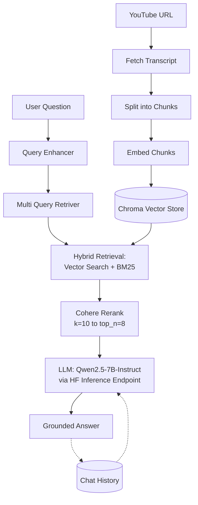

# 🎥 YouTube Video RAG Chatbot

Chat with any YouTube video. Paste a link, ask a question, and get answers grounded in what's actually said in the video — powered by hybrid retrieval (vector + BM25 search) and Cohere reranking, orchestrated end-to-end with LangChain and LangGraph.

[](https://youtubevideorag.streamlit.app/)
[](https://youtube-video-rag-34pu.onrender.com)
[](https://www.python.org/)
[](https://fastapi.tiangolo.com/)
[](https://streamlit.io/)
[](#license)

---

## Table of Contents
- [Live Demo](#live-demo)
- [Features](#features)
- [How It Works](#how-it-works)
- [Tech Stack](#tech-stack)
- [Project Structure](#project-structure)
- [Getting Started](#getting-started)
- [API Reference](#api-reference)
- [Usage](#usage)
- [Deployment](#deployment)
- [Known Limitations](#known-limitations)
- [Roadmap Ideas](#roadmap-ideas)
- [Contributing](#contributing)
- [License](#license)
- [Acknowledgments](#acknowledgments)

## Live Demo

| | |
|---|---|
| 🖥️ **Frontend (Streamlit)** | [youtubevideorag.streamlit.app](https://youtubevideorag.streamlit.app/) |
| ⚙️ **Backend API (Render)** | [youtube-video-rag-34pu.onrender.com](https://youtube-video-rag-34pu.onrender.com) |

> The API is hosted on Render. If it's been idle for a while (free-tier services spin down after inactivity), the first request may take up to a minute while it wakes up — subsequent requests will be fast.

## Features

- **Ingest any public YouTube video** by URL — its transcript is fetched and indexed automatically.
- **Ask natural-language questions** about the video and get answers grounded in the actual transcript.
- **Multi-Query Retriever** generates diverse query perspectives for broader and more robust recall.
- **Hybrid retrieval** combining dense vector search (Chroma) with sparse keyword search (BM25) for precision matching.
- **Reranking with Cohere** to keep only the most relevant passages before generation.
- **Multi-turn conversation memory** — follow-up questions retain context.
- **Clear chat** or **reset session** controls to start fresh with a new video.
- **FastAPI backend + Streamlit chat UI**, with the backend fully Dockerized for easy redeployment.

## How It Works

1. **Ingest** — you submit a YouTube URL. The backend fetches the transcript, splits it into chunks, embeds them, and stores them in a Chroma vector store.
2. **Retrieve** — the query is expanded via a **Multi-Query Retriever** into multiple perspectives, then candidate passages are pulled using hybrid search (dense vector similarity plus BM25 keyword matching).
3. **Rerank** — the candidates (`k=10`) are reranked with Cohere Rerank down to the most relevant ones (`top_n=8`).
4. **Generate** — the reranked passages, your question, and the running chat history are sent to the LLM (Qwen2.5-7B-Instruct, served via a Hugging Face Inference Endpoint) to produce a grounded answer.
5. The whole chain is orchestrated with **LangGraph**, and conversation history is tracked server-side so follow-up questions work naturally.



## Tech Stack

**Backend**

| Category | Tools |
|---|---|
| Framework | FastAPI, Uvicorn |
| Orchestration | LangChain, LangGraph, LangSmith |
| Vector store | ChromaDB (`langchain-chroma`) |
| Keyword search | `rank-bm25` |
| Reranking | Cohere (`langchain-cohere`) |
| LLM | Qwen2.5-7B-Instruct via Hugging Face Inference Endpoints |
| Also wired in | Google Gemini (`langchain-google-genai`), Groq (`langchain-groq`) |
| Transcript fetching | `youtube-transcript-api`, `supadata` |
| Validation & config | Pydantic, `python-dotenv` |

**Frontend**

| Category | Tools |
|---|---|
| Framework | Streamlit |
| HTTP client | `requests` |

**Tooling & Deployment**

| Category | Tools |
|---|---|
| Package manager | [uv](https://github.com/astral-sh/uv) |
| Containerization | Docker |
| API hosting | [Render](https://render.com/) |
| Frontend hosting | [Streamlit Community Cloud](https://streamlit.io/cloud) |

## Project Structure

```
Youtube_Video_RAG/
├── Ingestion/             # Transcript fetching, chunking & vector store creation
│   └── ingestion_chain.py # run_ingestion_chain(url) -> {documents, vector_store}
├── Pipeline/              # Query-time RAG chain & conversation memory
│   ├── query_chain.py     # run_rag_chain(...) -> {answer}
│   └── chat_memory.py     # get_chat_history / update_chat_history / clear_chat_history
├── Retrieval/             # Hybrid retrieval (vector + BM25) and reranking logic
├── api.py                 # FastAPI app — deployed on Render
├── Frontend.py            # Streamlit chat UI — deployed on Streamlit Cloud
├── main.py                # CLI entry point for local testing
├── Dockerfile             # Container definition for the API
├── pyproject.toml         # Project metadata & dependencies (uv)
├── requirements.txt       # Exported/pinned dependencies
└── uv.lock                # uv lockfile
```

## Getting Started

### Prerequisites
- Python 3.11+ (the Docker image uses `python:3.11-slim`; note `pyproject.toml` currently pins `requires-python >= 3.14`, so align these if `uv sync` complains about your local interpreter)
- [uv](https://docs.astral.sh/uv/) (recommended — the project ships a `uv.lock`) or `pip`
- API keys for the providers you use (added via a `.env` file — see step 3 below)

### 1. Clone the repo
```bash
git clone https://github.com/RoronoaZoro450/Youtube_Video_RAG.git
cd Youtube_Video_RAG
```

### 2. Install dependencies

With `uv` (recommended):
```bash
uv sync
```

With `pip`:
```bash
pip install -r requirements.txt
```

### 3. Environment variables
Create a `.env` file in the project root. Based on the providers wired into this project, you'll likely need some or all of:

```env
HUGGINGFACEHUB_API_TOKEN=your_huggingface_token   # LLM (Qwen2.5-7B-Instruct)
COHERE_API_KEY=your_cohere_api_key                # Reranking
SUPADATA_API_KEY=your_supadata_api_key            # Transcript fetching
GOOGLE_API_KEY=your_google_api_key                # Gemini (if used)
GROQ_API_KEY=your_groq_api_key                    # Groq (if used)
```
> Double-check these variable names against how they're actually read inside `Ingestion/` and `Pipeline/` — adjust if your code expects different names.

### 4. Run locally

**Option A — CLI only** (fastest way to test the pipeline, no server needed):
```bash
python main.py
```
This prompts for a YouTube URL, then lets you chat about it directly in the terminal.

**Option B — Full stack (API + Streamlit UI)**

Start the API:
```bash
uvicorn api:app --reload --port 8000
```

Then, in `Frontend.py`, temporarily point `API_URL` at your local server instead of Render:
```python
API_URL = "http://localhost:8000"
```

Start the frontend:
```bash
streamlit run Frontend.py
```

**Option C — Docker (API only)**
```bash
docker build -t youtube-rag-api .
docker run -p 8000:8000 --env-file .env youtube-rag-api
```

## API Reference

Base URL (deployed): `https://youtube-video-rag-34pu.onrender.com`

| Method | Endpoint | Description | Body |
|---|---|---|---|
| `GET` | `/` | Health check | – |
| `POST` | `/ingest_video` | Fetch transcript & index a video | `{"url": "https://www.youtube.com/watch?v=..."}` |
| `POST` | `/query` | Ask a question about the ingested video | `{"query": "your question"}` |
| `GET` | `/chat_history` | Get the current conversation history | – |
| `POST` | `/clear_history` | Clear conversation history (keep video loaded) | – |
| `POST` | `/reset` | Clear everything — history, index, and loaded video | – |

Example:
```bash
# Ingest a video
curl -X POST https://youtube-video-rag-34pu.onrender.com/ingest_video \
  -H "Content-Type: application/json" \
  -d '{"url": "https://www.youtube.com/watch?v=gdgZ-X87Bwg"}'

# Ask a question about it
curl -X POST https://youtube-video-rag-34pu.onrender.com/query \
  -H "Content-Type: application/json" \
  -d '{"query": "What is this video about?"}'
```

## Usage

1. Open **[youtubevideorag.streamlit.app](https://youtubevideorag.streamlit.app/)**.
2. Paste a YouTube video URL into the **Load a Video** box and click **Ingest**.
3. Once you see "Video loaded", ask anything about the video in the chat box below.
4. Use **🗑️ Clear Chat** to wipe the conversation but keep the same video loaded, or **🔄 Reset Session** to start over with a new video.

## Deployment

- **Frontend:** deployed on [Streamlit Community Cloud](https://streamlit.io/cloud), pointed at `Frontend.py`.
- **Backend:** deployed on [Render](https://render.com/) from the `Dockerfile`, which builds the image, installs dependencies with `uv sync --frozen --no-dev`, and runs:
  ```bash
  uvicorn api:app --host 0.0.0.0 --port 8000
  ```

To redeploy the backend: push to `main` and let Render rebuild (if auto-deploy is enabled), and make sure your API keys are set as environment variables in the Render dashboard.

## Known Limitations

- **Single global session** — the API keeps one shared video + chat history for all users rather than per-user/session state. Fine for solo use or a demo; if multiple people use the public demo at the same time, they'll share the same session.
- **Ephemeral index** — the Chroma vector store is rebuilt on every ingest and wiped on reset or restart; nothing persists between sessions.
- **Requires captions** — only videos with an available transcript/captions can be ingested.

## Roadmap Ideas

- [ ] Per-user/session-scoped state instead of one global session
- [ ] Persistent vector storage across restarts
- [ ] Streamed, token-by-token responses in the UI
- [ ] Support for playlists or multiple videos per session
- [ ] Automated tests + CI

## Contributing

Contributions and suggestions are welcome!

1. Fork the repo
2. Create a feature branch (`git checkout -b feature/amazing-feature`)
3. Commit your changes (`git commit -m "Add amazing feature"`)
4. Push to the branch (`git push origin feature/amazing-feature`)
5. Open a Pull Request

## License

No license has been specified for this project yet — consider adding one (e.g. [MIT](https://choosealicense.com/licenses/mit/)) if you'd like others to freely use or contribute to it.

## Acknowledgments

- [LangChain](https://www.langchain.com/) & [LangGraph](https://www.langchain.com/langgraph) for RAG orchestration
- [Cohere](https://cohere.com/) for reranking
- [Hugging Face](https://huggingface.co/) for LLM inference
- [ChromaDB](https://www.trychroma.com/) for vector storage
- [Streamlit](https://streamlit.io/) for the frontend
- [Render](https://render.com/) for API hosting
